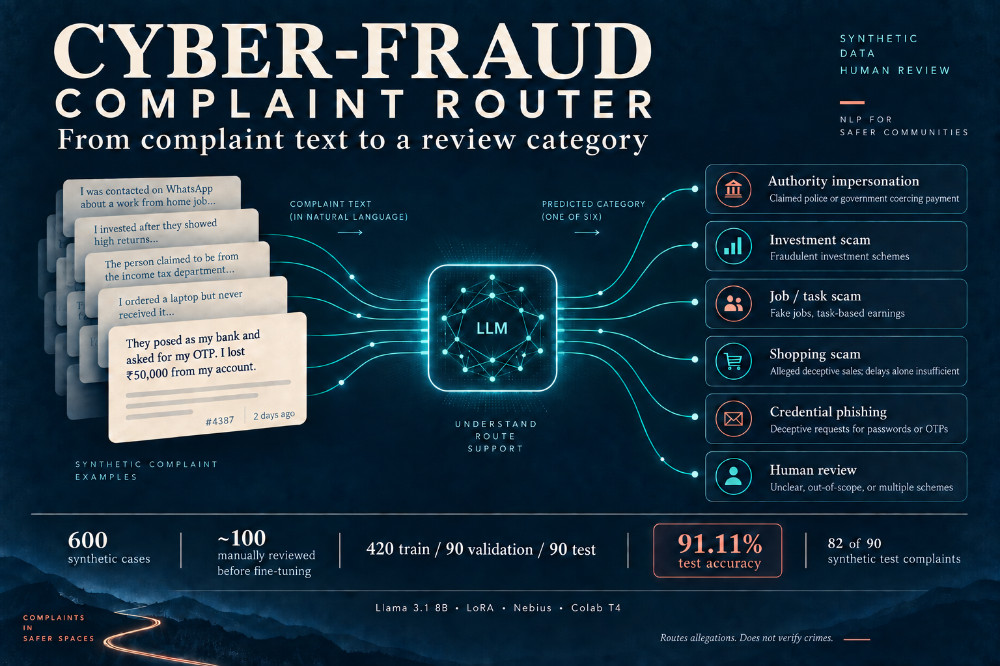

# Cyber-Fraud Complaint Router

A classroom machine-learning project that reads a complaint and predicts which review category it belongs to. The aim is to help a reviewer sort incoming complaints—not to decide whether a crime occurred or write a response to the complainant.

**What was completed:** a synthetic dataset, manual review of around 100 cases, LoRA fine-tuning on Nebius, and evaluation in Google Colab. The fine-tuned model correctly classified **82 of 90 test complaints (91.11%)**.

## What does it do?

**Example input:** “A recruiter promised me a job, collected a recruitment fee, then blocked me. The company confirmed that the vacancy was fake.”

**Model output:** `C` → **Job / task scam**.

The model returns one category letter. A future application could use that category to select a review queue; this repository demonstrates classification and does not connect to an operational complaints system.

| Letter | Category | What it covers |
|---|---|---|
| A | Authority impersonation | Claimed police or government authority coercing payment. |
| B | Investment scam | Alleged deceptive investment or trading schemes. |
| C | Job / task scam | Alleged deceptive recruitment, employment, or paid tasks. |
| D | Shopping scam | Alleged deceptive sales of goods or tickets; ordinary delays alone are insufficient. |
| E | Credential phishing | Deceptive requests for passwords, OTPs, or recovery secrets without a more specific scheme. |
| F | Human review | Unclear, out-of-scope, ordinary service issues, or multiple schemes with no primary incident. |

## How I built it

1. **Prepared the data.** Created 600 AI-authored synthetic English complaints, with 100 examples per category. These are invented examples, not actual victim reports.
2. **Reviewed examples manually.** I manually reviewed around 100 cases before fine-tuning, including pilot and selected review cases. This covered a subset; it does not mean all 600 cases were independently human-validated.
3. **Separated learning from testing.** Used 420 cases for training, 90 for validation, and 90 for the final test. Validation helped assess training; test cases were reserved for the final comparison.
4. **Fine-tuned the model.** Trained a LoRA adapter for Llama 3.1 8B Instruct on Nebius Token Factory for three epochs. LoRA learns a small set of additional weights while keeping the base model frozen. Selected the third-epoch checkpoint.
5. **Loaded and checked the result.** Loaded the base model in 4-bit precision on a Colab T4 GPU and attached the adapter. All 448 adapter tensors loaded successfully. The fake recruiter example returned the expected category C.
6. **Evaluated both versions.** Compared the original base model with the adapter disabled against the fine-tuned version on the same 90 test complaints, then inspected the mistakes and response-format issues.

Training ran on **Nebius**; **Colab was used for inference and evaluation**. The adapter remains separate from the base model in this project; it was not merged into standalone model weights.

## What were the results?

| Fine-tuned model measure | Result |
|---|---:|
| Correct classifications | 82 / 90 |
| Accuracy | 91.11% |
| Macro F1 (averages performance across categories) | 0.906 |
| Valid single-letter responses | 90 / 90 |
| Human-review cases correctly identified | 9 / 15 (60%) |

These results apply to this small synthetic test set, not to real-world complaints.

**Why does the baseline look unusually low in the screenshots?** The original model often wrote an explanation instead of a category letter. The first automated check rejected all its answers; a later check still rejected 61. A separate examination of the saved answers recovered 64 correct categories out of 90 (71.11%). That examination was devised after seeing the outputs, so it is an exploratory audit, not a controlled proof of a 71.11% → 91.11% improvement. The screenshots' 0% and 12.22% baseline scores should not be read as pure classification ability.

The [evaluation report](EVALUATION_REPORT.md) includes per-category precision, recall and F1, the eight mistakes, and the baseline comparison details. [Raw predictions and confusion matrices](results/) are included for inspection.

## Evidence from the completed run

The saved notebook contains code and completed outputs. **You can review it without a GPU, login, or rerunning any cells.**

[Open the executed notebook](Cyber_Fraud_Fine_Tuning.ipynb)

**Example prediction:** the fake recruiter complaint returned C, matching the expected job / task scam category.

**Evaluation:** both models completed predictions on 90 cases. Read the baseline explanation above alongside this table.

[Additional screenshots: model loading, prediction and initial evaluation](screenshots/from-google-doc/README.md)

## What is in this repository?

| Asset | Purpose |
|---|---|
| [Executed notebook](Cyber_Fraud_Fine_Tuning.ipynb) | Actual loading, inference and evaluation code with saved outputs. |
| [600-case dataset](cyber_fraud_complaints_600.json) | Full synthetic dataset. |
| [Training](train_complaints.json), [validation](validation_complaints.json), [test](test_complaints.json) | The 420 / 90 / 90 splits. |
| [Training JSONL](cyber_fraud_train.jsonl) and [validation JSONL](cyber_fraud_validation.jsonl) | Conversational inputs prepared for fine-tuning. |
| [System prompt](system_prompt.txt) and [label mapping](label_mapping.json) | Category definitions and output format. |
| [Adapter files](adapter/) | Downloaded Nebius checkpoint and associated configuration/tokenizer files. |
| [Evaluation report](EVALUATION_REPORT.md) and [results](results/) | Metrics, predictions, confusion matrices and error analysis. |
| [Project scope](PROJECT_SCOPE.md) | How this custom project relates to the Week 5 handout. |

## Rerunning the project

To rerun model inference, use a suitable GPU and your own Hugging Face account with approved access to Llama 3.1 8B Instruct. Enter your token only in the hidden authentication field. The executed notebook records the original workflow, including uploads and troubleshooting cells; it is evidence of the run rather than a clean one-click setup.

The optional `Cyber_Fraud_Demo.ipynb` provides automatic adapter downloads and a complaint-entry form. Its code was statically checked, but a fresh end-to-end run was blocked by Colab GPU usage limits. It should not be treated as a verified hosted application. No paid inference API is required; GPU availability or hosting may still have costs.

## Limitations and next steps

Six of the eight errors were complaints that should have gone to human review but were assigned a specific scam category. Improving these boundaries is the main next step. Further changes should use training and validation data, followed by a fresh independently reviewed test set, since the current test results have now been inspected.

The dataset is synthetic and English-only. The model has not been validated on real complaints, does not provide calibrated confidence, and requires human oversight. The human-review output is a learned category, not a confidence threshold. Faster or cheaper performance was not established by a controlled benchmark.

Built with Llama. Base model use and redistribution are subject to the [Llama 3.1 Community License](https://huggingface.co/meta-llama/Llama-3.1-8B-Instruct/blob/main/LICENSE).
