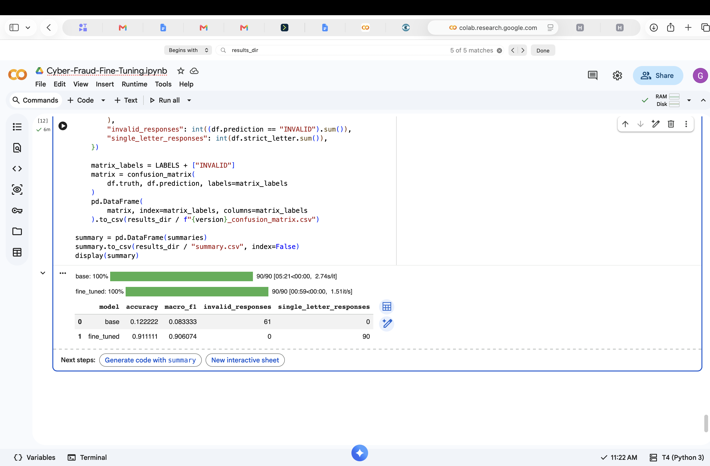
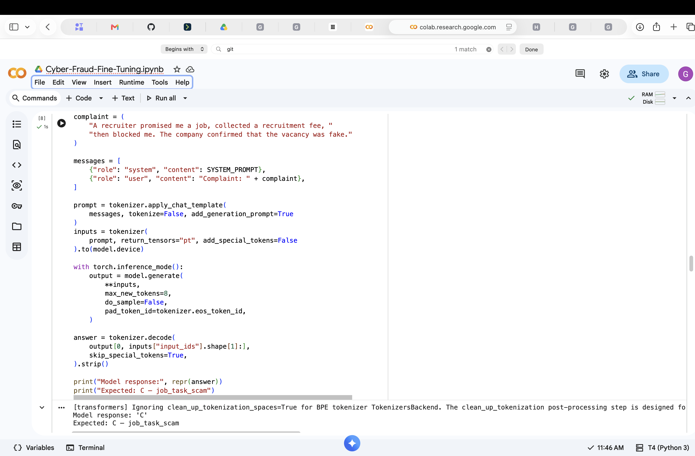

# Cyber-Fraud Complaint Router

Llama-3.1-8B-Instruct fine-tuned with LoRA on Nebius; evaluated on Google Colab T4 with 4-bit NF4 inference.

**91.11% accuracy, 0.906 macro-F1, 100% single-letter compliance on 90 held-out synthetic complaints.** Read EVALUATION_REPORT.md for the baseline parser limitation, exploratory response audit, and human-review failures.

## Included
- Dataset splits and conversational JSONL training inputs
- Original Nebius adapter and tokenizer files
- Raw predictions, confusion matrices, and both original experiment summaries
- Evaluation report

## Executed notebook

Executed notebook: [Cyber_Fraud_Fine_Tuning.ipynb](Cyber_Fraud_Fine_Tuning.ipynb)

## Successful notebook runs

Fine-tuned model evaluation on 90 held-out synthetic complaints: **91.11% accuracy, 0.906 macro F1, and zero invalid responses**. Base-model scores in this table are affected by output-format compliance; see [the evaluation report](EVALUATION_REPORT.md) for the exploratory response audit.

The fine-tuned model correctly classifies a fake recruitment complaint as **C — job_task_scam**.

Additional evidence: [model loading, prediction, and initial evaluation screenshots](screenshots/from-google-doc/README.md).

## Viewing and running the project

Open the [executed notebook](Cyber_Fraud_Fine_Tuning.ipynb) to view the code and saved results—no setup is needed to review them. To rerun the model, use a suitable GPU and your own Hugging Face account with approved access to Llama 3.1 8B Instruct. Enter your access token only in the notebook’s hidden authentication field.

## Limitations
Synthetic English data and small test set. Predictions describe allegations and route for review; they do not establish criminal conduct. No calibrated confidence estimates. This prototype requires human oversight.

Built with Llama. Base model use and redistribution are subject to the Llama 3.1 Community License: https://huggingface.co/meta-llama/Llama-3.1-8B-Instruct/blob/main/LICENSE
