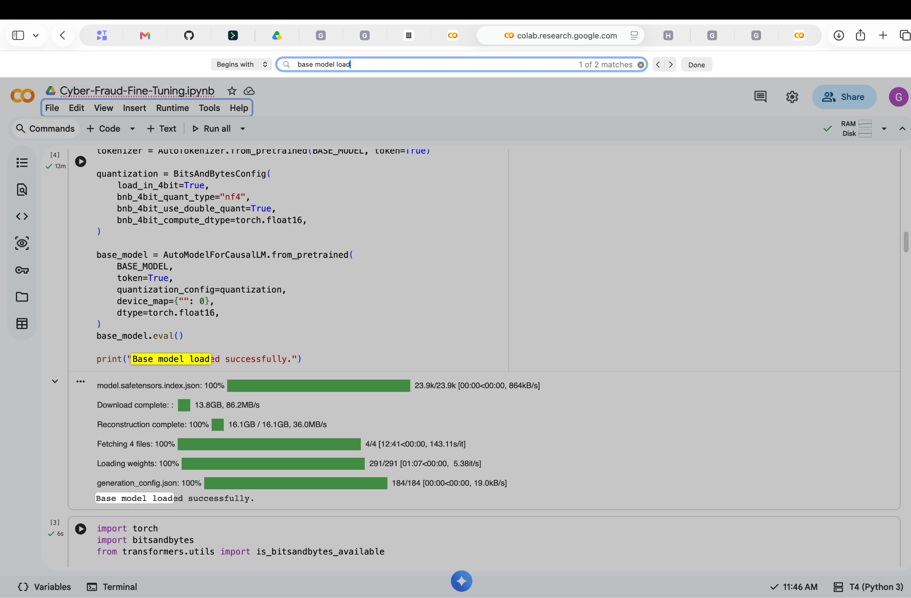
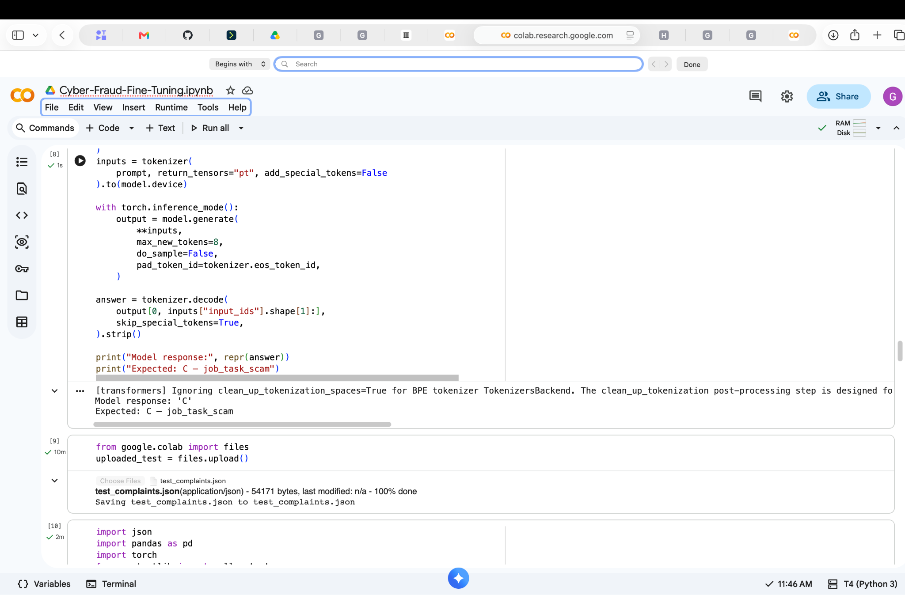
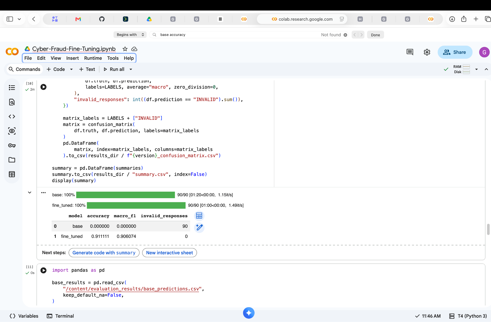

# Additional notebook screenshots

Screenshots supplied in the project Google document.

## Base model loaded

## Successful prediction
The output C matches the expected job-task scam category.

## Initial evaluation
This is the earlier eight-token evaluation. All 90 base-model outputs were rejected by the strict parser, so its displayed zero score does not establish zero classification ability. The fine-tuned model achieved 82/90 correct. See the [evaluation report](../../EVALUATION_REPORT.md) for the later evaluation and response audit.

